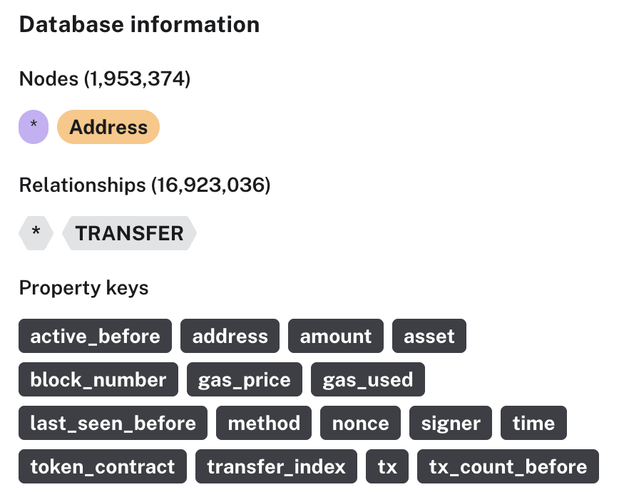

# Bybit theft graph

Public Ethereum transfers around the Bybit cold-wallet theft on 21 February 2025. The cold wallet `0x1db92e2eebc8e0c075a02bea49a2935bcd2dfcf4` was drained to `0x47666fab8bd0ac7003bce3f5c3585383f09486e2`. This repo downloads that window from BigQuery and follows the funds forward.

The download is public chain data from `bigquery-public-data.goog_blockchain_ethereum_mainnet_us`.

## Graph

The window is 21 February 2025 through 7 March 2025. The walk starts at the cold wallet and the receiver and follows outgoing transfers for 10 hops. A wallet is expanded only after it has received traced funds, and only transfers at or after that time are kept. Outgoing transfers from the cold wallet are kept when the target is the receiver and the time is at or after the theft, 2025-02-21 14:13:35 UTC.

A wallet with more than 50,000 outgoing transfers in the window is not expanded. The transfer into that wallet stays in the graph.

`--noise` adds separate walks from the local database. Seeds are transfers of at least 100 ETH, stETH, mETH, cmETH, or WETH to a wallet that was not already reached.

Each wallet also records whether it had a transfer in the 90 days before 21 February.

## Files

- `download_graph.py` downloads the window, walks the graph, and writes `out/`.
- `to_dump.py` writes `out/graph.dump` from the node and edge files. Neo4j Desktop can open that dump.

`out/` is generated and is not committed.

## Neo4j

`to_dump.py` loads the export into Neo4j. Addresses are nodes. A transfer is a relationship between two addresses.

We also provide a .dump file that's a snapshot of an existing Neo4j DB containing the data, hosted at the public S3 bucket: `s3://gds-public-dataset/bybit-hack-graph.dump`. You can use Neo4j's load functionality to load this .dump into your DB.



## Run

```bash
pip install google-cloud-bigquery
gcloud auth application-default login
python3 download_graph.py --project YOUR_PROJECT_ID
python3 download_graph.py --noise
python3 to_dump.py
```

`--project` is the Google Cloud project that runs the query. The script stops before a query would pass a 900 GiB cap. A later run skips tables already saved under `out/raw/` and keeps the graph when `out/graph.sqlite` and `out/edges.csv` already exist. `--rebuild-graph` loads the raw files again and walks from the cold wallet.

`--noise` does not call BigQuery. It reads `out/graph.sqlite`.

`to_dump.py` needs Neo4j Desktop installed.